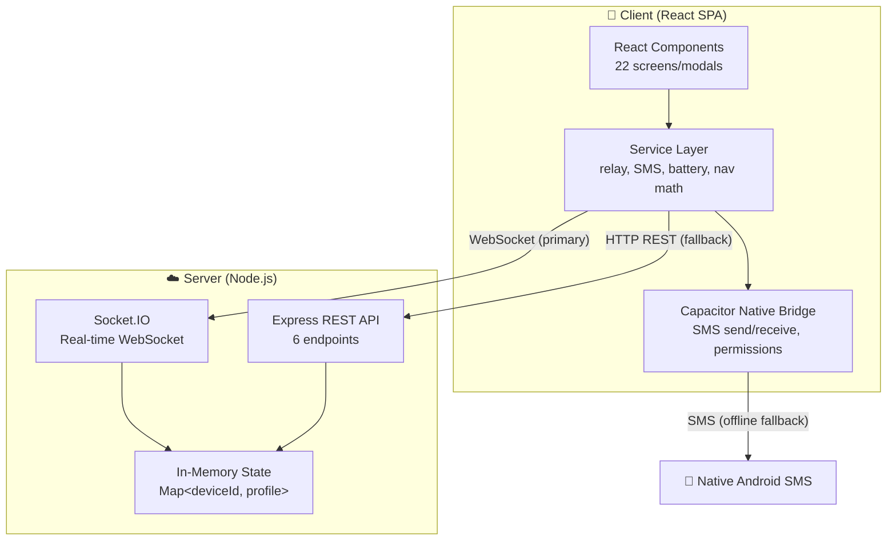
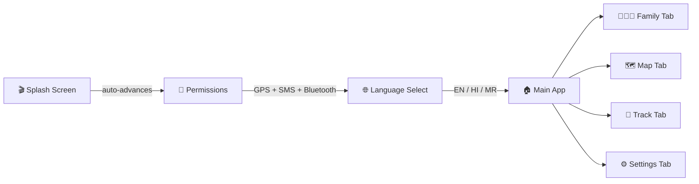
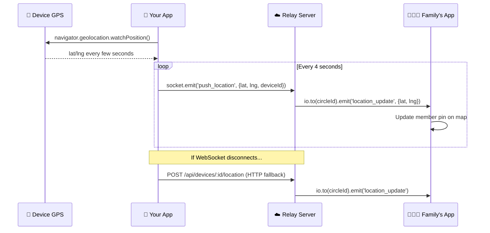
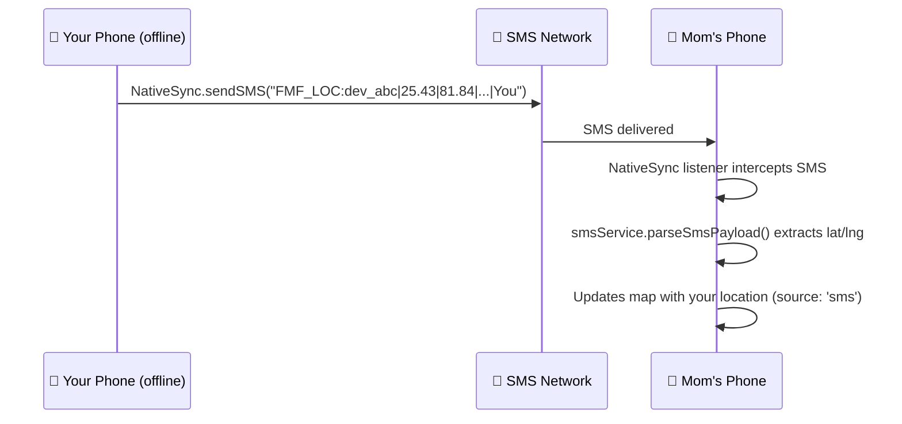
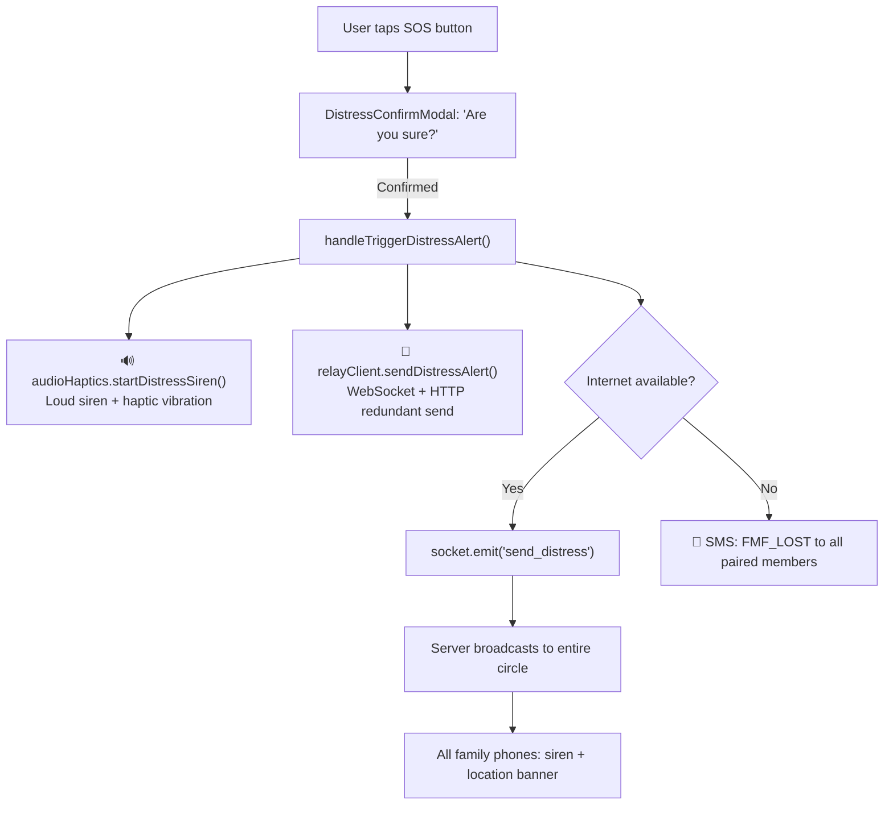
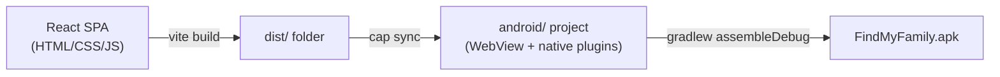

# How FindMyFamily Actually Works — A Complete Walkthrough

> **FindMyFamily** is a real-time family location-sharing app built for massive crowded events like **Kumbh Mela**. It lets family members track each other on a live map, send SOS distress alerts, and even works **offline via SMS**.

---

## 🎯 The Core Idea

Imagine you're at Kumbh Mela with 40 million people. Your family member gets separated. You open FindMyFamily, and you can:

1. **See them on a live map** with their GPS pin
2. **Follow a compass arrow** pointing directly at them
3. **Trigger an SOS distress alert** that blares a siren on their phone
4. **Fall back to SMS** if there's no internet — the app sends GPS coordinates via text message

**No sign-up, no accounts, no passwords.** You open the app, get a random device ID, join a "circle" (family group), and you're sharing locations.

---

## 🏗️ Architecture at a Glance



---

## 📱 Frontend — What the User Sees

### Technology Stack

| What | Technology | Why It's Used |
|---|---|---|
| **UI Framework** | React 19 | Component-based UI, reactive state updates |
| **Language** | TypeScript 5.8 | Type safety across the whole codebase |
| **Build Tool** | Vite 6.2 | Lightning-fast HMR dev server + production bundling |
| **Styling** | Tailwind CSS v4 | Rapid utility-first styling |
| **Icons** | Lucide React | Clean, consistent icon set |
| **Animations** | Motion (Framer Motion) | Smooth page transitions, splash animation |
| **Maps** | Leaflet (via CDN) | Free, open-source map with OpenStreetMap tiles |
| **Real-time Comms** | Socket.IO Client | WebSocket connection to the server |
| **Native Bridge** | Capacitor 8.5 | Wraps the web app into an Android APK |

### How the User Flow Works



#### Step-by-step:

1. **Splash Screen** ([SplashScreen.tsx](file:///d:/FindMyFamily/src/components/SplashScreen.tsx)) — Animated logo, auto-advances after a few seconds
2. **Permissions** ([PermissionsScreen.tsx](file:///d:/FindMyFamily/src/components/PermissionsScreen.tsx)) — Requests GPS, SMS, and Bluetooth permissions (uses Capacitor native plugin on Android)
3. **Language Select** ([LanguageSelectScreen.tsx](file:///d:/FindMyFamily/src/components/LanguageSelectScreen.tsx)) — Pick English, Hindi, or Marathi
4. **Main App** — Four bottom tabs:
   - **Family** ([HomeScreen.tsx](file:///d:/FindMyFamily/src/components/HomeScreen.tsx)) — List of circle members with distance, battery %, and SOS button
   - **Map** ([MapScreen.tsx](file:///d:/FindMyFamily/src/components/MapScreen.tsx)) — Live Leaflet map showing all members as colored pins
   - **Track** ([ArrowScreen.tsx](file:///d:/FindMyFamily/src/components/ArrowScreen.tsx)) — Compass arrow pointing toward a selected member (uses device orientation + Haversine math)
   - **Settings** ([SettingsHubScreen.tsx](file:///d:/FindMyFamily/src/components/SettingsHubScreen.tsx)) — Profile, server URL, rooms, help

### State Management — No Redux, Just React

All app state lives in [App.tsx](file:///d:/FindMyFamily/src/App.tsx) as `useState` hooks and is passed down as props. Key state:

| State | What It Holds | Persistence |
|---|---|---|
| `myDeviceId` | Your unique ID (e.g., `dev_a3k9x`) | `localStorage` — survives app restarts |
| `myDeviceName` | Display name | `localStorage` |
| `circleId` | Family group name (e.g., `KUMBH-2026`) | `localStorage` |
| `pairedMembers` | Array of family members + their last known locations | `localStorage` |
| `myLocation` | Your current GPS coordinates | Live from `navigator.geolocation.watchPosition()` |
| `compassHeading` | Device compass direction (0–360°) | Live from `DeviceOrientation` API |
| `myBattery` | Battery percentage | Live from Web Battery API |

---

## ☁️ Backend — The Relay Server

### Technology Stack

| What | Technology | Why It's Used |
|---|---|---|
| **Runtime** | Node.js | JavaScript on the server |
| **Framework** | Express 4.21 | REST API endpoints |
| **Real-time** | Socket.IO 4.8 | WebSocket rooms for circle-based broadcasting |
| **Language** | TypeScript (executed via `tsx`) | Shared types with the frontend |
| **Prod Bundler** | esbuild | Compiles `server.ts` → `dist/server.cjs` for production |

### What the Server Does

The server is a **single file**: [server.ts](file:///d:/FindMyFamily/server.ts). It does three things:

#### 1. Manages Circle Rooms (In-Memory)

```
devices:        Map<deviceId → DeviceProfile>     // Who's online
circles:        Map<circleId → Set<deviceId>>      // Which devices are in which circle
socketToDevice: Map<socketId → deviceId>           // Socket ↔ device mapping
directPairings: Map<deviceId → Set<deviceId>>      // Explicit 1-on-1 pairs
```

> [!IMPORTANT]
> **There is NO database.** Everything lives in server RAM. Restart the server → all state is gone. This is intentional — the app is designed for ephemeral event use.

#### 2. REST API (6 endpoints)

| Endpoint | What It Does |
|---|---|
| `GET /health` | Health check — returns device/socket counts |
| `GET /circles/:id/devices` | List all members in a circle |
| `GET /devices` | List all connected devices globally |
| `POST /devices/:id/location` | Push GPS location (HTTP fallback when WebSocket is down) |
| `POST /devices/:id/pair` | Create explicit 1-on-1 pairing between two devices |
| `POST /devices/:id/lost-alert` | Broadcast a distress alert to the whole circle |
| `GET /download` | Download the `.apk` file directly (for Wi-Fi distribution at events) |

#### 3. WebSocket Events (Socket.IO)

| Direction | Event | Purpose |
|---|---|---|
| Client → Server | `register` | Join a circle room |
| Client → Server | `push_location` | Push GPS coordinates (every 4 seconds) |
| Client → Server | `send_distress` | Send SOS alert |
| Server → Client | `circle_members` | Initial member list when you join |
| Server → Client | `location_update` | Another member's GPS changed |
| Server → Client | `distress_alert` | Someone triggered SOS |
| Server → Client | `member_joined` | A new device joined your circle |

---

## 🔄 How Location Sharing Actually Works — The Data Flow

### Online Mode (WebSocket → HTTP fallback)



**The relay client** ([relayClient.ts](file:///d:/FindMyFamily/src/services/relayClient.ts)) handles this automatically:
- If Socket.IO is connected → emit via WebSocket
- If disconnected → fall back to HTTP POST
- Reconnection: up to 30 attempts, 1-second delay

### Offline Mode (SMS Fallback)

When there's **no internet at all**, the app encodes GPS coordinates into compact SMS messages:

```
FMF_LOC:dev_a3k9x|25.4358|81.8463|1693929600000|Mom
FMF_LOST:dev_a3k9x|25.4358|81.8463|1693929600000|Mom    ← distress
```



The SMS service ([smsService.ts](file:///d:/FindMyFamily/src/services/smsService.ts)) handles encoding/decoding, and the native bridge ([nativeSync.ts](file:///d:/FindMyFamily/src/services/nativeSync.ts)) sends/receives SMS via a custom Capacitor plugin.

---

## 🆘 How the Distress (SOS) System Works



When a distress alert is received:
- **Siren audio** plays loudly (Web Audio API oscillator in [audioHaptics.ts](file:///d:/FindMyFamily/src/services/audioHaptics.ts))
- **Haptic vibration** triggers on the device
- **Red distress banner** appears showing the sender's name and location
- **Map auto-centers** on the distressed member

---

## 📲 How It Becomes an Android APK

The web app is wrapped into a native Android APK using **Capacitor**:



| Step | Command | What Happens |
|---|---|---|
| 1. Build frontend | `vite build` | React app → optimized `dist/` folder |
| 2. Sync to Android | `cap sync` | Copies `dist/` into the Android project's assets |
| 3. Build APK | `gradlew assembleDebug` | Compiles native Android project with WebView |

The [capacitor.config.ts](file:///d:/FindMyFamily/capacitor.config.ts) configures:
- **App ID**: `com.kumbhathon.findmyfamily`
- **Web directory**: `dist` (where Vite outputs the built app)
- **HTTPS scheme** for the Android WebView
- **Mixed content allowed** (so HTTP fallback works alongside HTTPS)

### Custom Native Plugin: `NativeSync`

A custom Capacitor plugin provides native Android capabilities that web APIs can't:

| Method | What It Does |
|---|---|
| `requestBluetoothPermissions()` | Request Bluetooth permissions |
| `requestSmsPermissions()` | Request SMS read/send permissions |
| `sendSMS({phoneNumber, message})` | Send an SMS programmatically |
| `addListener('smsReceived', fn)` | Listen for incoming SMS (to intercept FMF messages) |

---

## 🗺️ How Maps & Navigation Work

### Map (Leaflet + OpenStreetMap)

- **Leaflet** is loaded via CDN in [index.html](file:///d:/FindMyFamily/index.html) (not npm)
- **Tile source**: OpenStreetMap (free, no API key)
- Your location: **pulsing green circle** (CSS animation)
- Family members: **color-coded pins** with name + battery badge
- Selected member: **dashed route line** drawn between you and them

### Compass Arrow (Track Tab)

The arrow screen uses pure math from [navigationMath.ts](file:///d:/FindMyFamily/src/services/navigationMath.ts):

1. **Haversine formula** → calculates distance to target (in meters)
2. **Great-circle bearing** → calculates compass direction to target (0–360°)
3. **Arrow angle** = `(bearing - compassHeading + 360) % 360` → rotates the arrow on screen
4. **Direction advice** → "Walk Left", "Straight Ahead", etc. (in English, Hindi, or Marathi)

Compass heading comes from the browser's `DeviceOrientation` API (iOS uses `webkitCompassHeading`, Android uses `(360 - alpha) % 360`).

---

## 🌐 Deployment — Two Modes

### 1. Cloud (Render.com)

- Deployed to `https://findmyfamily.onrender.com`
- TLS/HTTPS handled by Render
- Anyone with the URL can use it

### 2. Local Wi-Fi (The Kumbh Mela Use Case)

Run the server on a laptop connected to a shared Wi-Fi hotspot:

```bash
npm run dev   # → http://192.168.x.x:3000
```

- Family members on the same Wi-Fi visit the URL in their browser
- They can **download the APK** directly via `http://<laptop-ip>:3000/download`
- **No internet required** — everything runs on the local network

---

## 🔧 Complete Technology Summary

| Layer | Technology | Purpose |
|---|---|---|
| **Frontend Framework** | React 19 | UI components & reactive rendering |
| **Language** | TypeScript 5.8 | Type-safe code across frontend + backend |
| **Build Tool** | Vite 6.2 | Dev server (HMR) + production bundling |
| **CSS** | Tailwind CSS v4 | Utility-first styling |
| **Animations** | Motion (Framer Motion) | Page transitions, micro-animations |
| **Icons** | Lucide React | SVG icon library |
| **Maps** | Leaflet + OpenStreetMap | Interactive map with GPS pins |
| **Real-time** | Socket.IO (client + server) | WebSocket-based location streaming |
| **Backend** | Express 4.21 on Node.js | REST API + static file serving |
| **Backend Execution** | `tsx` (dev) / `esbuild` (prod) | Run TypeScript directly / bundle for production |
| **Native Wrapper** | Capacitor 8.5 | Web → Android APK conversion |
| **Native Platform** | Android (Java/Kotlin) | SMS send/receive, permissions |
| **AI (optional)** | Google Gemini (`@google/genai`) | AI-powered features |
| **Hosting** | Render.com | Cloud deployment with auto-TLS |
| **Spatial Math** | Custom (Haversine/bearing) | Distance & direction calculations |
| **Audio** | Web Audio API | Distress siren generation |
| **Compass** | DeviceOrientation API | Device heading for arrow navigation |
| **Battery** | Web Battery API | Live battery monitoring |
| **Storage** | `localStorage` (client) / RAM (server) | No database by design |
| **i18n** | Custom module (`src/i18n/`) | English, Hindi, Marathi translations |

---

## 🔑 Key Design Decisions

| Decision | Rationale |
|---|---|
| **No database** | Ephemeral event use — state only needs to last during the event |
| **No authentication** | Zero-friction onboarding — families in crisis shouldn't need passwords |
| **Three communication tiers** | Internet may be spotty at massive events — WebSocket → HTTP → SMS |
| **Leaflet via CDN (not npm)** | Simpler integration, avoids bundle bloat |
| **Single-file server** | Entire backend in one `server.ts` — easy to deploy and understand |
| **Client-generated device IDs** | No server round-trip needed for identity — works offline from the start |
| **Local Wi-Fi mode** | At remote events, cloud internet may not exist — run everything on a laptop |
